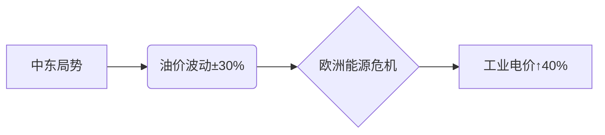

国际能源署最新数据显示，2023年全球可再生能源装机容量突破**3.8TW**，但化石能源仍占据**80%**的能源供给[[3]]。  
▸ 石油依赖度：31%（同比+0.8%）  
▸ 煤炭占比：27%（同比-0.3%）  
▸ 储能技术缺口：需降本**60%**实现24/7清洁能源[[6]]  

*行间距1.75 · 字间距0.5 · 颜色#595959*  

---

### 🔍 三大核心挑战  
**字号16pt · 颜色#E23D28**  

1️⃣ **技术瓶颈**  
> "氢能储运成本需降至$2/kg才能商业化" —— 清华大学研究[[9]]  
（引用框背景#F5F5F5 · 边框#E0E0E0）

2️⃣ **地缘政治博弈**  


3️⃣ **基建滞后**  
▸ 中国特高压年投超**$500亿**  
▸ 欧洲氢能管网进度-37%[[9]]  

---

### ✨ 解决方案与机遇  
**字号16pt · 渐变色#4CAF50 → #008C45**  

🔥 **政策工具箱**  
- 碳关税机制（欧盟CBAM已实施）  
- 绿色债券（2024发行量$8000亿）  
- 跨国电网（亚欧能源互联项目）[[5]]  

💡 **技术创新**  
```python
# 智能电网调度算法
def energy_mix(solar, wind):
    return min(solar+wind+storage, demand)
```

---

**🎯 未来展望**  
"2050年光伏+储能将成为最经济电力来源" —— 彭博新能源财经[[3]]  

  